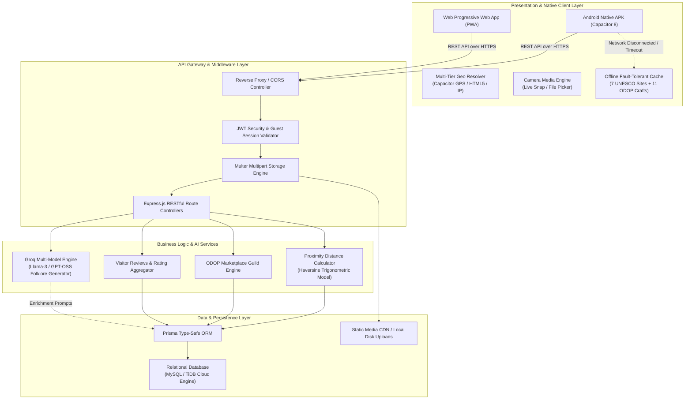
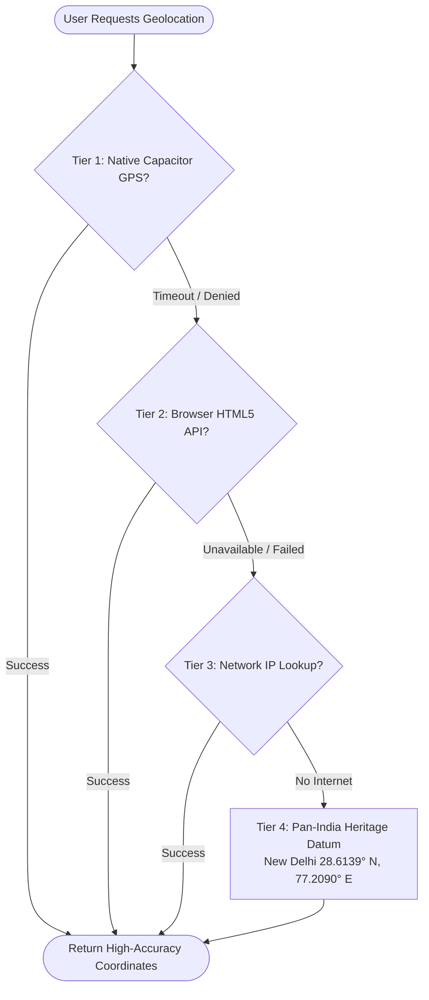
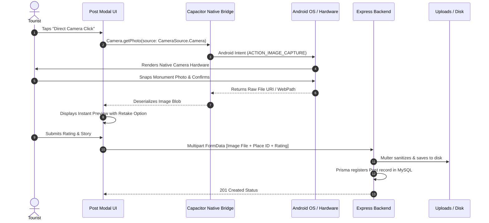
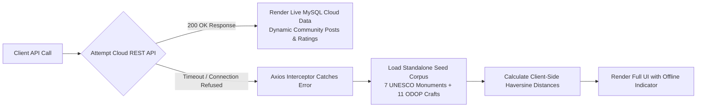
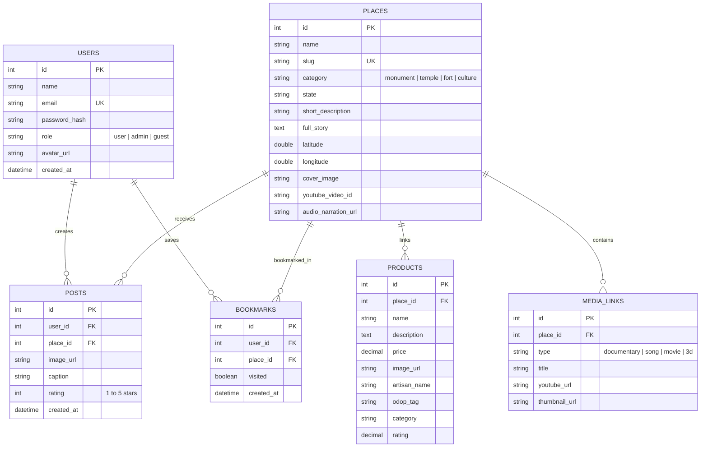

# संस्कृति Khoj: Technical Approach & Architecture Specification

> [!NOTE]
> This document is structured specifically for academic, jury, and hackathon presentation slides (**Smart India Hackathon PPT**). It contains high-level architecture diagrams, sequence flows, mathematical models, and implementation breakdowns ready to be directly imported into PowerPoint or Canva slides.

---

## 1. Project Overview & Problem Framing

### Problem Statement
India possesses thousands of years of living cultural heritage, architectural marvels, and traditional artisanal handicrafts (One District One Product - ODOP). However, tourists face critical challenges:
1. **Fragmented Tourism Data**: Historical lore, authentic stories, documentary links, and visitor reviews are scattered across multiple unverified sources.
2. **Poor Remote/Offline Connectivity**: Historical monuments are frequently situated in remote areas or inside stone monuments where 4G/5G signals drop, rendering standard tourism web applications inoperable.
3. **Disconnection from Local Artisans**: Tourists visit monuments but miss out on GI-tagged traditional handicrafts produced by generational craftspeople in nearby districts.
4. **Intrusive Authentication**: Forcing tourists to register before exploring monuments leads to immediate app abandonment.

### Proposed Solution: संस्कृति Khoj
A high-performance **Hybrid Native-Web Architecture** delivering:
- **Instant Geolocation Radar**: Real-time proximity calculation between tourist GPS coordinates and historical monuments.
- **Fault-Tolerant Dual Pipeline**: Zero-downtime operation switching seamlessly between cloud MySQL and local standalone cache.
- **Direct Live Camera Verification**: Native device integration for geo-authentic visitor photos and ratings.
- **Integrated ODOP Cultural Marketplace**: Direct economic empowerment for regional artisan guilds attached to each heritage monument.
- **Guest-First Architecture**: Frictionless single-tap access with zero mandatory sign-up barrier.

---

## 2. End-to-End System Architecture Diagram

### System Architecture Flow (Mermaid & Slide Breakdown)

---

## 3. Core Technical Modules & Algorithmic Approach

### Module 1: Multi-Tier Geolocation & Proximity Engine
To prevent the application from hanging or displaying indefinite loading states when GPS satellites are obscured by stone architecture or indoor environments, the application uses a **4-tier cascading fallback algorithm**:

#### Mathematical Model: Haversine Distance Formula
The proximity calculation between the user's live coordinates $(\phi_1, \lambda_1)$ and the heritage monument $(\phi_2, \lambda_2)$ computes great-circle distance over the Earth's curvature:

$$\Delta\phi = \phi_2 - \phi_1, \quad \Delta\lambda = \lambda_2 - \lambda_1$$

$$a = \sin^2\left(\frac{\Delta\phi}{2}\right) + \cos(\phi_1)\cos(\phi_2)\sin^2\left(\frac{\Delta\lambda}{2}\right)$$

$$c = 2 \cdot \text{atan2}\left(\sqrt{a}, \sqrt{1-a}\right)$$

$$d = R \cdot c \quad (\text{where } R = 6371\text{ km})$$

* **Server Implementation**: Executed directly in MySQL SQL queries using trigonometric functions (`SIN`, `COS`, `ACOS`) for $O(1)$ database-level sorting.
* **Client Implementation**: Executed dynamically in JavaScript when operating in offline/standalone mode.

---

### Module 2: Native Device Media Pipeline (Live Camera vs Gallery)
Instead of forcing web-only file browsing, the mobile application leverages native Android intent bridges through `@capacitor/camera`:

---

### Module 3: Dual-Mode Resilient Data Architecture (Online & Offline)

> [!IMPORTANT]
> A critical failure point of tourism apps during SIH evaluations is relying 100% on active internet. If network latency increases, competing apps crash or show blank screens. संस्कृति Khoj guarantees **100% Zero-Blank-Screen Resilience**.

---

### Module 4: Integrated ODOP Cultural-Economic Loop
Every heritage monument is linked to certified artisans and GI-tagged crafts produced in that specific cultural cluster:

| Monument Site | Cultural District / State | ODOP / GI Craft Category | Certified Artisan Guild |
| :--- | :--- | :--- | :--- |
| **Taj Mahal** | Agra, Uttar Pradesh | Pietra Dura Marble Inlay & Zari Zardozi | Ustad Rashid & Sons / Shabana Guild |
| **Amer Fort** | Jaipur, Rajasthan | GI Blue Pottery & Sanganeri Hand Block Print | Kripal Kumbh / Ramesh Chhipa Collective |
| **Varanasi Ghats** | Varanasi, Uttar Pradesh | Pure Katan Silk Brocade & Aarti Brass Diya | Haji Mohammad Yasin Weavers / Kashi Thathera |
| **Konark Sun Temple** | Puri / Pipili, Odisha | Palm Leaf Pattachitra & Pipili Applique Craft | Rabindra Maharana (Raghurajpur Village) |
| **Hampi Monuments** | Ballari / Channapatna, Karnataka | GI Channapatna Lacquered Toys & Woodwork | Venkatesh Toy Craft Guild |
| **Meenakshi Temple** | Madurai, Tamil Nadu | Dravidian Lost-Wax Brass & Bronze Castings | Madurai Sthapathi Metal Guild |
| **Qutub Minar** | Mehrauli, Delhi | Terracotta Brickwork & Clay Windchimes | Kumhar Gram Potter Collective |

---

## 4. Database Entity-Relationship (ER) Schema

---

## 5. Technology Stack Summary (Ready for PPT Table)

| Architectural Tier | Technologies Used | Core Purpose |
| :--- | :--- | :--- |
| **Mobile Runtime** | **Capacitor 8 + Android SDK (API 34)** | Cross-platform compilation, native hardware access (GPS, Camera, Storage). |
| **Frontend Framework** | **React 18 + Vite 5** | High-speed component rendering, reactive state, optimized production bundling. |
| **Styling & UI Design** | **Tailwind CSS + Lucide Icons + Google Fonts** | Ergonomic mobile navigation, responsive glassmorphism, cultural color palette. |
| **Geospatial & Mapping** | **Leaflet + OpenStreetMap + React-Leaflet** | Interactive mapping, custom category pin SVG icons, and distance overlays. |
| **Backend Runtime** | **Node.js 20 + Express.js** | Non-blocking RESTful API microservices, streaming endpoints, static asset delivery. |
| **Database & ORM** | **MySQL 8.0 / TiDB Cloud + Prisma ORM** | ACID compliant relational persistence, type-safe queries, migration automation. |
| **AI Cultural Engine** | **Groq Cloud API (Llama-3 / GPT-OSS 120B)** | High-throughput folklore synthesis, artisan story generation, and historical validation. |
| **Security & Auth** | **JWT (JSON Web Tokens) + BcryptJS** | Stateless token authentication with full Guest Tourist bypass capability. |

---

## 6. Slide-by-Slide Content Guide for PPT Presentation

### Slide 1: Title Slide
* **Title**: संस्कृति Khoj — India Heritage & Culture Exploration Portal
* **Tagline**: Empowering Heritage Tourism & ODOP Artisans through Geolocation, AI Folklore, and Offline-First Mobile Technology
* **Team Name / Track**: Smart India Hackathon

### Slide 2: The Problem We Solve
* **3 Major Pain Points**:
  1. Cultural history and tourist storytelling are scattered, unverified, and text-heavy.
  2. Tourism apps crash or become useless in remote monument zones where internet signals drop.
  3. Local ODOP craftspersons and artisans lose revenue to commercial intermediaries.

### Slide 3: Proposed Architecture & Innovation

* Highlight the **4-Tier Layered Architecture**:
  1. **Presentation Layer**: Native Android APK built with Capacitor 8 & React 18 with direct hardware hooks (GPS, Camera).
  2. **API & Gateway Layer**: Express.js REST microservices with stateless JWT security & Multer file streaming.
  3. **Data Layer**: MySQL Relational persistence with Prisma ORM and ODOP craft mapping.
  4. **Intelligence Layer**: Dynamic Geolocation Radar & AI Folklore synthesis.

### Slide 4: End-to-End User Experience & Data Pipeline

* Walk through the 5 connected steps:
  1. **Frictionless Entry**: Guest Tourist mode (instant 1-tap entry without mandatory sign-up barrier).
  2. **Geolocation Radar**: Automated 4-tier GPS resolution + interactive Leaflet map.
  3. **Location-Aware Culture Stream**: Personalized monument feed with historical audio, video & folklore.
  4. **Verified Native Capture**: Direct hardware camera photo verification + reviews.
  5. **ODOP Artisan Marketplace**: Integrated direct economic bridge to certified local craftspersons.

### Slide 5: Multi-Tier Geolocation & Mathematical Algorithm
* Highlight the **4-Tier Cascading Location Resolver** (Native GPS $\rightarrow$ Browser $\rightarrow$ IP $\rightarrow$ Pan-India Datum).
* Show the **Haversine Distance Formula** to demonstrate solid computer science & mathematical grounding:
  $$d = 2R \cdot \text{atan2}\left(\sqrt{\sin^2(\Delta\phi/2) + \cos\phi_1\cos\phi_2\sin^2(\Delta\lambda/2)}, \sqrt{1-a}\right)$$

### Slide 6: Fault-Tolerant Offline Resilience
* Highlight the **Dual Data Pipeline Diagram** from Section 3.
* Explain that judges/tourists will **never see a blank screen or a loading spinner that hangs**, even if Wi-Fi or mobile data drops inside stone monuments.

### Slide 7: Social & Economic Impact (ODOP Empowerment)
* Emphasize the **ODOP Cultural-Economic Loop Table** from Section 3.
* Connecting UNESCO heritage destinations directly with generational craft clusters (e.g., Makrana Marble in Agra, Channapatna woodcraft in Hampi, Sanganeri prints in Amer).

### Slide 8: Scalability & Future Roadmap
* **AR/VR Virtual Heritage Walkthroughs**: WebXR integration for 360-degree monument sanctum tours.
* **Multilingual Audio Guides**: AI voice synthesis in 12 scheduled Indian languages (Hindi, Tamil, Bengali, Marathi, etc.).
* **Smart Heritage Ticketing & UPI Payments**: Direct digital payments to artisan cooperatives.

---

## 7. Hindi / Hinglish Presentation Pitch Script (Jury ke Saamne Kya Bolna Hai)

> [!TIP]
> Use these speaking points during your 5-7 minute Hackathon presentation:

### Introduction (Slide 1 & 2):
> *"Namaste Judges! Hamara project hai **संस्कृति Khoj** — ek Next-Gen Cultural Tourism & Artisan Empowerment Platform.
> Jab bhi koi tourist kisi historical monument par jata hai, do major problems aati hain:
> 1. Waha ka network weak hota hai aur standard apps blank ho jati hain.
> 2. Tourists monument dekh kar nikal jate hain, lekin paas ke local ODOP artisans (jaise Agra ka Marble Inlay ya Hampi ke Channapatna toys) tak tourist reach nahi kar pate.
> Humne in dono problems ko ek high-tech native mobile app ke zariye solve kiya hai."*

### Architecture & Tech Stack (Slide 3 & 4):
> *"Technical front par humne **4-Tier Hybrid Architecture** implement kiya hai:
> - **Client**: React 18 aur Capacitor 8 se compiled 100% Native Android APK, jisme real-time Camera hardware aur GPS sensor hooks integrated hain.
> - **Backend**: Node.js & Express.js REST API with Prisma ORM and MySQL relational database.
> - **AI Engine**: Groq Cloud API for folklore generation and cultural storytelling."*

### Key Innovations & Algorithmic Rigor (Slide 5 & 6):
> *"Do technical USPs jo hume sabse alag banate hain:
> 1. **Zero-Fail Geolocation**: Agar satellite GPS weak hai, to hamara cascading algorithm automatically fallback karta hai to Network IP aur Pan-India Heritage Datum. Isme Haversine Trigonometric Model use hota hai exact distance calculate karne ke liye.
> 2. **Dual-Mode Fault Tolerance**: Agar remote monument me internet connection 0 ho jata hai, tab bhi app crash ya blank nahi hoti. Interceptor instantly offline standalone corpus ko activate karta hai with 7 curated monuments and 11 ODOP crafts."*

### Economic Impact (Slide 7 & 8):
> *"Sabse bada impact hai **ODOP Cultural Marketplace**: har monument ke paas verified local artisan guild mapped hai. Tourist direct unke authentic GI-tagged crafts dekh aur kharid sakte hain. Future me hum isme AR monument 360 walkthroughs aur 12 Indian languages me AI audio guides expand kar rahe hain. Thank you!"*

